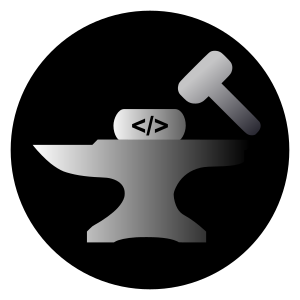

<!-- Project Logo -->

<p align="center">
  
</p>

<p align="center">
  <a href="https://hamiltonleguizamon.github.io/localforge-engine-web/index.html" target="_blank" rel="noopener noreferrer">
    
  </a>
  <br/>
  <b>✨ Try the <a href="https://hamiltonleguizamon.github.io/localforge-engine-web/index.html" target="_blank">visual preview of the LocalForge Engine Web UI</a>!</b><br/>
  <sub>(This is a non-functional demo for design/UX preview only.)</sub>
</p>

# LocalForge Engine

LocalForge Engine is a local continuous integration and deployment (CI/CD) system and a multi-functional project generator, developed in Python. It allows you to run build, test, and deploy pipelines automatically, as well as generate project structures for various technologies with predefined configuration and best practices.

## Requirements ⚠️

Before installing or using LocalForge Engine, make sure you have the following tools installed:

- **Python 3.8+** (with pip) — main runtime
- **Docker** — for building, running, and deploying containers
- **Node.js & npm** — required for Node.js and React project generation
- **Git** — required for all template-based project generation (e.g., Cookiecutter for Flask/Django)

> **Note:** All commands and scripts are cross-platform. Use PowerShell, Bash, or your preferred terminal.

## Project Structure

```text
CI_CD/
├── core/                               # LocalForge Engine Core
│   └── src/
│       ├── main.py                     # Main pipeline engine and CLI
│       ├── project_generator.py        # Official project generation CLI script (localforge-generate)
│       ├── app/                        # Core application logic
│       ├── cli/                        # Command line interface
│       ├── generators/                 # Technology-specific generators
│       ├── utils/                      # General utilities
│       └── web/                        # Web interface
├── examples/                           # Generated example projects
├── logs/                               # Log files directory
├── run_pipeline.py                     # Quick access script for pipelines
├── run_ui.py                           # Quick access script for web UI
├── requirements.txt                    # Python dependencies
├── setup.py                            # Package setup script
└── install.sh                          # Installation script
```

## Main Features

### CI/CD Pipelines

- **Pipeline Execution**: Support for sequential and parallel execution of steps defined in YAML files
- **Robust CLI**: Command line interface to run pipelines, pass environment variables, and configure behavior
- **Advanced Logging**: Centralized logging configuration with different levels and file output
- **State Management**: Pipeline manager tracks progress, history, and statistics of pipeline executions
- **Reports**: Pipeline execution reports and statistics

### Project Generator

- **Multiple Project Types**: Project generation for:
  - **Flask**: Professional REST APIs with Cookiecutter, Docker, CI/CD, and security
  - **Django**: Complete web applications with cookiecutter-django, Docker, PostgreSQL
  - **Node.js**: REST APIs with Express, middleware, routing, and testing with Jest
  - **React**: Modern applications with Vite, TypeScript (optional), React Router, Vitest, and Docker
- **Unified CLI**: Easy project creation from the terminal using `localforge-generate`
- **Flexible Configuration**: Options for project name, output directory, custom templates and interactive mode
- **TypeScript & Port Customization**: For React projects, easily enable TypeScript and set the dev server port
- **Full Project Tree Output**: After generation, the CLI prints the full directory tree of your new project
- **Extensible**: Architecture based on a registry that allows adding new generator types easily

### Web Interface

- **Interactive Dashboard**: Modern web interface built with Flask and SocketIO for real-time interactions
- **Comprehensive Management**: Complete control over your development workflow
  - **Pipeline Operations**: Browse, execute, and monitor pipeline files with live progress tracking
  - **Project Creation**: Interactive forms with advanced configuration options for all supported project types
  - **Real-time Monitoring**: Live updates for pipeline execution and project generation status
  - **History & Analytics**: View execution history, statistics, and performance metrics
- **Developer-Friendly**:
  - Intuitive interface designed for developers
  - Real-time WebSocket connections for instant updates
  - Responsive design that works on different screen sizes
- **API Access**: RESTful endpoints (`/api/`) for programmatic integration and automation

### General

- **Modularity**: Code organized into clear components (app, cli, generators, web)
- **Quick Access Scripts**: Simple scripts to facilitate usage
- **Editable Install**: Supports pip editable install for development

## Installation

### Recommended: Automated Installation (All Platforms)

The easiest and most reliable way to install LocalForge Engine:

1. **Clone the repository:**

   ```sh
   git clone https://github.com/HamiltonLeguizamon/LocalForge-Engine
   cd LocalForge-Engine
   ```
2. **Run the automated installation script:**

   ```bash
   bash install.sh
   ```

   This script will:

   - ✅ Check all required dependencies (Python, Docker, Node.js, Git)
   - 🔧 Create and activate a Python virtual environment (`.venv`)
   - 📦 Install all dependencies automatically
   - 🚀 Set up LocalForge Engine in development mode

> **Note for Windows users:** You must run this script from Bash (Git Bash or WSL), not from CMD or PowerShell.

### Manual Installation (Alternative)

If you prefer manual control or need to troubleshoot:

```sh
# Clone and navigate
git clone https://github.com/HamiltonLeguizamon/LocalForge-Engine
cd LocalForge-Engine

# Create and activate virtual environment
python -m venv .venv
# Windows: .venv\Scripts\activate
# Linux/macOS: source .venv/bin/activate

# Install dependencies
pip install -r requirements.txt
pip install -e .
```

### OS-Specific Installation Guides

For detailed platform-specific instructions, system requirements, and troubleshooting:

- 🐧 **[Ubuntu Installation Guide](docs/ubuntu-installation.md)** - VM setup, Docker permissions, and Ubuntu-specific troubleshooting
- 🪟 **[Windows Installation Guide](docs/windows-installation.md)** - PowerShell, Docker Desktop, winget/chocolatey installation methods
- 🍎 **[macOS Installation Guide](docs/macos-installation.md)** - Homebrew setup

## Usage

### 1. Web Interface (Recommended)

The easiest way to use LocalForge Engine is through the interactive web interface.

**Start the web application:**

```sh
localforge-ui
```

By default, the interface will be available at `http://localhost:5001`.

### 2. Generate New Projects (CLI)

For command-line project generation, use the official CLI:

```sh
# Help
localforge-generate --help

# List available project types
localforge-generate --list-types

# Generate a Flask project
localforge-generate --type flask --name my_flask_api

# Generate a Django project in a specific directory
localforge-generate --type django --name my_django_app --output ./my_projects

# Generate a Node.js project
localforge-generate --type node --name my_node_service

# Generate a React project with TypeScript and custom port
localforge-generate --type react --name my_react_frontend --typescript --port 4000

# Use a custom Cookiecutter template (for compatible types like Flask/Django)
localforge-generate --type flask --name my_custom_flask --template https://github.com/your_user/your_flask_template.git

# Interactive mode for Cookiecutter
generate --type django --name my_interactive_django --interactive
```

**After project generation, the CLI will print the full directory tree of your new project.**

### 3. Run CI/CD Pipelines (CLI)

For advanced users who prefer command-line pipeline execution.

**Using the official CLI:**

```sh
# Help
localforge-pipeline --help

# Run a specific pipeline
localforge-pipeline --pipeline examples/my_project/pipeline.yml

# Pass environment variables
localforge-pipeline -p pipeline.yml --env MY_VARIABLE=value1 --env ANOTHER_VAR=value2

# Execute steps in parallel (if the pipeline supports it)
localforge-pipeline -p pipeline.yml --parallel

# Continue execution even if a step fails
localforge-pipeline -p pipeline.yml --continue

# Set logging level
localforge-pipeline -p pipeline.yml --log-level DEBUG
```

**Using the module (alternative):**

```sh
python -m core.src.main --pipeline examples/my_project/pipeline.yml
```

## Supported Project Types

LocalForge Engine can generate the following project types, each with an optimized structure and configuration:

- **`flask`**: Professional REST API with Flask
  - Generated using Cookiecutter templates
  - Includes Docker, CI/CD (pipeline.yml), and security best practices
- **`django`**: Complete web application with Django
  - Generated using cookiecutter-django (official or similar)
  - Includes Docker, PostgreSQL, and best practices
- **`node`**: REST API with Node.js and Express
  - Includes directory structure, middleware, basic routing
  - Configuration for testing with Jest
- **`react`**: Modern React application
  - Generated with Vite
  - Optional TypeScript support and custom port
  - Includes React Router for routing
  - Configuration for testing with Vitest
  - Deployment with Docker

## Getting Help

If you encounter issues:

1. Check the `logs/` directory for detailed error messages
2. Create a GitHub issue with:
   - Error logs from the `logs/` directory

## Contributing

Contributions are welcome! If you want to improve LocalForge Engine, please consider:

- Reporting bugs or proposing new features by creating an issue
- Sending Pull Requests with improvements or fixes

For more details, please read [LICENSE](LICENSE) file.

## License

This project is licensed under the MIT License - see the [LICENSE](LICENSE) file for details.

---

*README updated on June 26, 2025.*
